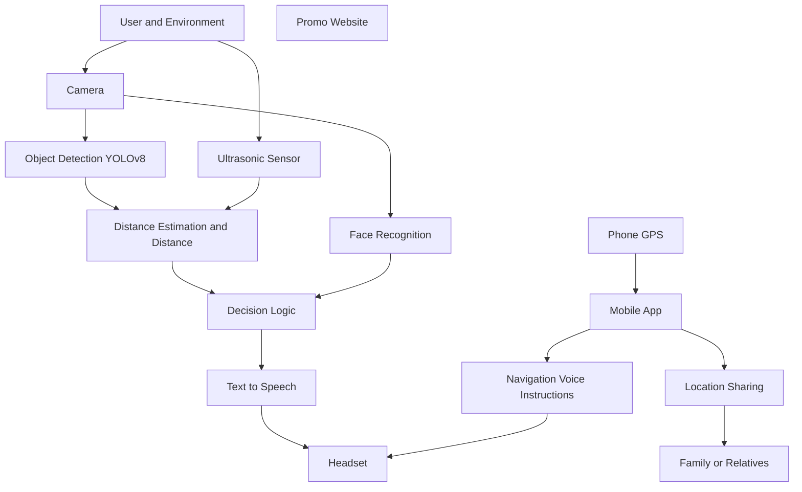
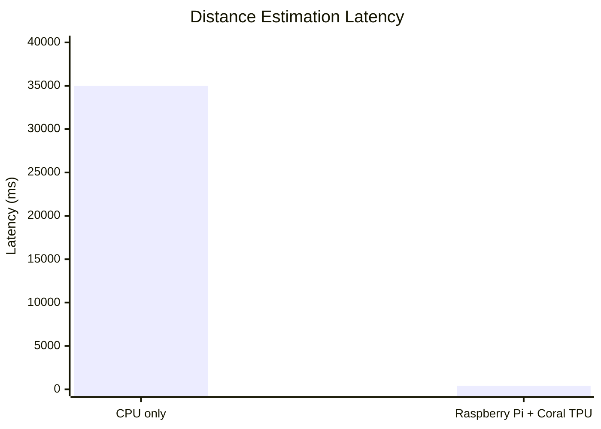
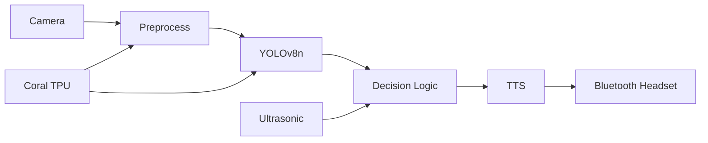
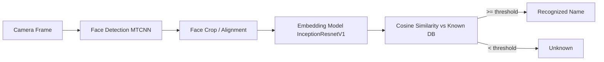

<p align="center">
  
</p>

<h1 align="center">Sight Sense</h1>

<p align="center">
  Smart assistive goggles for real-time obstacle detection, distance estimation, and voice feedback.
</p>

---

## Introduction

**Sight Sense** is an intelligent assistive system designed to enhance the mobility, safety, and independence of visually impaired individuals. The project integrates computer vision, machine learning, and embedded systems into a wearable solution capable of detecting obstacles, estimating their distance, and delivering real-time voice alerts.

Using an integrated camera, Sight Sense captures live visual data from the user’s surroundings. The system processes this data using advanced deep learning models such as **YOLOv8** for object detection and depth estimation models for calculating object proximity. When obstacles are detected, the results are converted into clear audio feedback through a text-to-speech module, allowing users to navigate their environment safely and confidently.

In addition to obstacle detection, Sight Sense includes a **face recognition system** to identify familiar individuals. Separately, a **mobile application** runs on the phone to provide GPS-based navigation, location sharing, and voice navigation instructions delivered to the **same headset** used by the goggles.

---

## Project Flow




---

## Components (Click-to-jump)

- [User and Environment](#User-and-Environment)
- [Ultrasonic Sensor](#ultrasonic-sensor)
- [Object Detection (YOLOv8)](#object-detection-yolov8)
- [Distance Estimation](#distance-estimation)
- [Face Recognition](#face-recognition)
- [Decision Logic](#decision-logic)
- [Text to Speech](#text-to-speech)
- [Headset](#headset)
- [Phone GPS](#phone-gps)
- [Mobile App](#mobile-app)
- [Location Sharing](#location-sharing)
- [Family or Relatives](#family-or-relatives)
- [Navigation Voice Instructions](#navigation-voice-instructions)
- [Promo Website](#promo-website)

---

# (1) Embedded Systems Integration

This section documents the **embedded + computer science work** behind *Sight Sense*: how we translated ML requirements into a deployable **embedded Linux** system, integrated I/O and audio feedback, and solved edge-performance constraints.

---

## 1) Engineering Plan (Phased Approach)

We structured the embedded development into four phases to ensure the final prototype was functional, efficient, and wearable.

### Phase 1 — Software Requirements → Hardware Constraints
- The ML pipeline required **camera input** and **low-latency on-device inference**.
- We standardized on **YOLOv8** for object detection (final deployment used **YOLOv8n exported to TFLite**).
- Key implications:
  - continuous camera streaming
  - real-time processing expectations
  - stable runtime stack on embedded Linux

### Phase 2 — Compute Platform Selection (Raspberry Pi + Coral TPU)
We compared multiple edge compute options available locally (Egypt) and selected a platform that balanced:
- **Performance** (CPU/RAM + I/O)
- **Portability**
- **Power efficiency**
- **Cost and availability**

**Decision:** Raspberry Pi 4 Model B was selected as the base compute platform.  
**Acceleration:** **Google Coral TPU was implemented alongside the Raspberry Pi** to accelerate AI workloads on embedded Linux.


### Phase 3 — External Hardware Integration (I/O + Feedback)
We planned and integrated the external peripherals early to avoid integration surprises:
- **Camera**: primary input for object detection (wide FOV preferred)
- **Ultrasonic sensor**: fast proximity fallback for safety
- **Bluetooth audio**: deliver spoken feedback to the user through a headset

### Phase 4 — Prototype Design & Packaging
We designed and iterated on a wearable prototype to fit components ergonomically into a glasses/goggles form factor while keeping:
- wiring manageable
- parts accessible for maintenance
- weight and balance reasonable

---

## 2) Mechanical Design (AutoCAD + 3D Printing Workflow)

The goggles were modeled using **CAD tools (AutoCAD / CAD workflow)** to ensure comfort and safe hardware placement. Design goals included:
- ergonomic fit across face shapes
- secure mounting points for the camera and sensors
- internal routing paths/tunnels for wiring
- ventilation and maintainability (easy assembly/disassembly)

### Design Iterations
- **Initial concept:** fully 3D-printed goggle frame + electronics housing  
  - pros: full customization  
  - cons: high cost, complex iterations, comfort risks


- **Improved CAD design:** more detailed routing and clearer wiring paths through tunnels/arms


- **Final approach (hybrid):** use a **ready-made pair of glasses** + **3D-printed clip-on housings** for the electronics  
  - improved comfort and fit
  - reduced material usage and print cost
  - modular maintenance (swap/upgrade parts)

 


**Material choice:** PLA (strength, ease of printing, cost, environmental friendliness).

---

## 3) Platform & OS Setup (Embedded Linux)

The goggles run on an **embedded Linux** environment. The embedded stack was designed around:
- **Linux-based OS** on the edge device
- **Python 3** for orchestration and integration
- a workflow that enabled fast iteration (early testing via notebook-based development when needed)

**Typical OS bring-up checklist**
1. Flash and boot the embedded Linux image.
2. Enable camera interface (device-specific).
3. Update packages and verify:
   - camera capture works
   - audio stack works
   - Bluetooth can pair with a headset
4. Install inference runtime + Python dependencies.

---

## 4) Camera Selection (Wide FOV + Autofocus)

Because the camera is the main input to the ML pipeline, we selected a wide-FOV autofocus camera to support real-world movement and reduce blur.


---

## 5) Model Deployment on Device (YOLOv8n → TFLite)

To make object detection suitable for embedded deployment, we used:
- **YOLOv8n (nano)** for a lightweight footprint
- exported to **TensorFlow Lite (TFLite)** for edge inference

**On-device pipeline**
1. Capture frame from camera
2. Run **YOLOv8n TFLite inference**
3. Parse detections (class, confidence, bounding boxes)
4. Pass results into decision logic
5. Generate spoken feedback

---

## 6) Distance Estimation (Latency Challenge → Coral TPU Fix)

Distance awareness is essential for navigation, but depth models can be expensive on edge CPUs.

### What we tried
- Depth estimation using **DepthAnything** (also compared against alternatives such as Zoe).

### The problem (CPU-only)
On Raspberry Pi-class CPU compute, distance estimation introduced major latency:
- **~30–40 seconds** per distance computation (not usable for real-time navigation)

### What fixed it (Coral TPU acceleration)
By integrating **Google Coral TPU** with the Raspberry Pi, we reduced the end-to-end distance estimation latency to approximately:
- **~400 ms**

This improvement made real-time feedback practical and significantly improved user safety.



---

## 7) Safety Fallback (Ultrasonic Sensor)

The ultrasonic sensor serves as a **fast, last-line safety mechanism** to protect the user in cases where:
- the vision model misses an obstacle
- inference is delayed
- an object suddenly appears at close range

To improve reliability, our ultrasonic pipeline:
- triggers an ultrasonic pulse and measures the echo time using GPIO edge detection
- collects multiple samples per reading
- applies a **median filter** to reduce noise and outliers
- converts the measured time-of-flight into an estimated distance

### Implementation (Embedded Linux / Raspberry Pi GPIO)

The module is implemented in Python using `RPi.GPIO`, with an event callback that timestamps the **rising and falling edges** on the echo pin. For each distance reading, the code gathers multiple measurements and returns the **median** for stability.

```python
# event callback: record echo timestamps (rising/falling edges)
def timer_call(channel):
    now = time.monotonic()
    stack.append(now)

# trigger a 10 microsecond pulse
def trigger():
    GPIO.output(trigger_pin, GPIO.HIGH)
    time.sleep(0.00001)
    GPIO.output(trigger_pin, GPIO.LOW)

# measure distance using multiple samples + median filtering
def check_distance():
    samples_list.clear()

    while len(samples_list) < number_of_samples:
        trigger()

        while len(stack) < 2:
            start = time.monotonic()
            while time.monotonic() < start + time_out:
                pass
            trigger()  # retry on timeout

        samples_list.append(stack.pop() - stack.pop())
        time.sleep(sample_sleep)

    return statistics.median(samples_list)
```
> **Full implementation is located in:** `embedded_systems/ultra_test.py`  
> *(Includes calibration constants, timeout handling, and conversion from echo time to distance.)*


---

## 8) Audio Feedback (Text-to-Speech + Bluetooth on Linux)

### Text-to-Speech (TTS)
We integrated TTS to convert system events into spoken guidance:
- Python-based TTS (e.g., **pyttsx3**) for offline speech output
- tuned parameters (rate, voice, volume) for clarity

### Bluetooth audio output
To deliver audio wirelessly:
- Bluetooth management on Linux (pairing/connection)
- audio routing through the Linux audio stack so spoken messages play reliably in the headset

**Why this matters (CS angle)**
This is the step that turns the pipeline into a usable product:
- not just inference, but stable, human-readable feedback in real time.

---

## 9) Startup & Deployment (Autostart on Boot)

To run the system automatically after boot, we used **crontab** for autostart.

### Issue
- startup delays were observed due to boot + cron launch timing.

### Future improvement
- replace cron autostart with a **systemd service** for:
  - faster startup
  - better logging
  - automatic restart on crash
  - dependency ordering (camera/Bluetooth/audio readiness)

---

## 10) Optional Software Diagram (Recommended)



---


# (2) AI and Machine Learning

## 1) Object Detection (YOLOv8)

Object detection is the core AI component in **Sight Sense**. Its job is to recognize **hazards and navigation cues** in real time from the goggles’ camera feed, then pass the detections to the system logic so the user can receive **audio guidance** (e.g., “stairs ahead”, “pothole”, “vehicle approaching”, etc.).

### Why object detection matters in Sight Sense?
For visually impaired navigation, the system must detect objects that can:
- cause **collisions** (e.g., barricades, potholes, stairs)
- indicate **crossing safety** (e.g., traffic lights, crosswalks)
- represent **dynamic obstacles** (e.g., vehicles, stray animals)

That means this is not a generic dataset problem — we had to define what “hazard” means, select the right classes, and make the model work reliably in outdoor scenes.

### YOLO (You Only Look Once)

We used **YOLO (You Only Look Once)** for real-time object detection because it offers a strong balance between **speed and accuracy**, which is essential for assistive navigation where **low latency** is critical. YOLO performs detection in a **single forward pass**, producing bounding boxes and class predictions efficiently compared to multi-stage detectors.

For our project, we trained and deployed **YOLOv8n** (the nano variant) to keep the model lightweight and suitable for embedded/edge execution. For deployment on the embedded device, the model was exported to **TensorFlow Lite (TFLite)** to reduce runtime overhead and improve inference efficiency on constrained hardware.

**YOLOv8 (Ultralytics) reference:** [Ultralytics YOLOv8 Documentation](https://docs.ultralytics.com/)

You can find the training pipeline code in `machine_learning/ObjectDetectionGoggles_TrainingCode.ipynb`

---

## A) Problem Definition: “Hazard” Classes

Before collecting any data, we first defined what **counts as a hazard** for a visually impaired user while walking outdoors. We prioritized objects that either:

- can cause **collision** (e.g., potholes, stairs, barriers)
- indicate **safe/unsafe crossings** (e.g., traffic lights, crosswalk)
- represent **dynamic obstacles** (e.g., vehicles, stray animals)

This led to an evolving class list across multiple dataset versions (see **Dataset Versions & Results** below).

---

## B) Data Collection & Annotation

Our dataset was built using a hybrid approach:

- **Online collection (partial):** we sourced images for common classes that are widely available online.
  > **Class links can be found here:** `machine_learning/ObjectDetectionGogglesDataset_Refrences.txt` 
- **Manual capture + labeling (critical):** for **rare/local classes** (or classes that were not reliably available online), we took photos ourselves and **annotated them manually**.
- **Annotation tooling:** we used **Roboflow** for labeling, dataset versioning, and augmentation workflows.

### Why manual capture mattered
Some hazards are **under-represented or inconsistently photographed online** (especially in our local environment). For those, we created our own dataset slices (capture → annotate → review → re-capture if needed). This is what made the dataset *usable for real navigation*, not just for “nice” benchmark images.

---

## C) Dataset Evolution: 3 Versions

We built the object detection dataset iteratively across **three versions**, improving data quality, class design, and model performance at each stage:

- **Version I (Baseline):** first complete dataset + first training runs (scratch vs pretrained).  
  Goal: establish a working pipeline and identify failure cases.
- **Version II (Refinement):** class adjustments and dataset cleanup (including reduced-class experiments and tuning).  
  Goal: fix V1 weaknesses and improve accuracy through better class design and training strategy.
- **Version III (Final):** expanded dataset with stronger augmentation and a key class update (**adding `person`**) to reduce confusion caused by humans appearing in hazard scenes.  
  Goal: improve robustness and final deployment readiness.

In the next sections, we will go **version by version**, and for each one we will include:
- dataset size (images + instances)
- class list
- training setup
- results (mAP@50 and mAP@50–95)
- what we learned and why we changed the dataset in the next version

---
## (I) V1 Classes (Initial Hazard Set)

V1 started with a wide set of hazards and navigation-relevant cues:

- `Autorickshaw`
- `Barricades`
- `Bench`
- `Bump`
- `Crosswalk`
- `Fire-hydrant`
- `Garbage`
- `Lampposts`
- `Potholes`
- `Stairs`
- `Stray Animals`
- `Green Light`
- `Railroad gate`
- `Red-light`
- `Vehicles`

### Class instances distribution (add plot)
To understand imbalance early, we plotted **instances per class** (V1):


> This plot guided later decisions (V2) because extremely low-representation classes (e.g., `Lampposts`) were consistently unstable and harmed training reliability.

---

## 4) Training Setup (V1)

We ran two main experiments for V1:

1. **Training from scratch** (100 epochs)  
2. **Training with a pretrained model** (100 epochs)

The goal was to measure:
- baseline learnability of V1 classes
- whether pretrained weights improve convergence and detection quality
- which classes fail consistently and why

---

## 5) Results (V1)

### 5.1 Summary comparison (add plot)
We compared overall performance across the two V1 experiments:


---

### 5.2 Detailed results table (V1)

#### A) Training from scratch (100 epochs)

| Class | Images | Instances | mAP50 | mAP50-95 |
|---|---:|---:|---:|---:|
| **All** | 1873 | 2740 | **0.660** | **0.432** |
| Autorickshaw | 1873 | 319 | 0.866 | 0.685 |
| Barricade | 1873 | 189 | 0.759 | 0.488 |
| Bump | 1873 | 86 | 0.416 | 0.223 |
| Bench | 1873 | 42 | 0.000 | 0.000 |
| Crosswalk | 1873 | 125 | 0.972 | 0.694 |
| Fire-hydrant | 1873 | 198 | 0.984 | 0.699 |
| Garbage | 1873 | 95 | 0.576 | 0.199 |
| **Lamppost** | 1873 | 19 | **0.000** | **0.000** |
| Potholes | 1873 | 417 | 0.762 | 0.442 |
| Stairs | 1873 | 45 | 0.773 | 0.532 |
| Stray Animals | 1873 | 303 | 0.738 | 0.425 |
| Green Light | 1873 | 162 | 0.543 | 0.323 |
| Railroad gate | 1873 | 208 | 0.787 | 0.570 |
| Red-light | 1873 | 152 | 0.653 | 0.408 |
| Vehicles | 1873 | 178 | 0.523 | 0.377 |


#### mAP@50 (per class)
> **Plot:** V1 Scratch — Per-Class mAP@50  
> 

#### mAP@50–95 (per class)
> **Plot:** V1 Scratch — Per-Class mAP@50–95  
> 


**Key observations (from-scratch):**
- Overall performance was *acceptable as a first baseline*, but multiple classes were unstable.
- `Lamppost` had **0.0 mAP**, indicating it was not being learned at all in V1.
- `Bench` also showed **0.0**, suggesting either class ambiguity, label noise, or insufficient examples.

---

#### B) Training with pretrained weights (100 epochs)

| Class | Images | Instances | mAP50 | mAP50-95 |
|---|---:|---:|---:|---:|
| **All** | 1873 | 2740 | **0.677** | **0.458** |
| Autorickshaw | 1873 | 319 | 0.873 | 0.713 |
| Barricades | 1873 | 189 | 0.734 | 0.480 |
| Bench | 1873 | 186 | 0.403 | 0.217 |
| **Lampposts** | 1873 | 42 | **0.000** | **0.000** |
| Crosswalk | 1873 | 125 | 0.861 | 0.678 |
| Fire-hydrant | 1873 | 198 | 0.991 | 0.697 |
| Garbage | 1873 | 195 | 0.423 | 0.220 |
| Potholes | 1873 | 417 | 0.805 | 0.479 |
| Stairs | 1873 | 45 | 0.795 | 0.606 |
| Stray Animals | 1873 | 308 | 0.755 | 0.453 |
| Green Light | 1873 | 223 | 0.870 | 0.520 |
| Railroad gate | 1873 | 162 | 0.739 | 0.484 |
| Red-light | 1873 | 153 | 0.651 | 0.426 |
| Vehicles | 1873 | 178 | 0.577 | 0.444 |


#### mAP@50 (per class)
> **Plot:** V1 Pretrained — Per-Class mAP@50  
> 


#### mAP@50–95 (per class)
> **Plot:** V1 Pretrained — Per-Class mAP@50–95  
> 


**Key observations (pretrained):**
- Overall mAP improved slightly (0.660 → 0.677).
- `Lampposts` remained **0.0**, meaning the failure was likely **dataset-level**, not optimizer/initialization.
- `Garbage` remained relatively weak, which suggested inconsistent visual patterns, label ambiguity, or inadequate examples.

---

## 6) What V1 Taught Us (Decisions for V2)

V1 gave us very actionable lessons that shaped V2:

1. **Some classes were not learnable in their current form**  
   - `Lampposts` consistently failed (0.0), likely due to low representation and visual ambiguity in real scenes.
2. **Class imbalance mattered immediately**  
   - The instances plot highlighted why some classes dominated training while others remained unstable.
3. **Pretraining helps, but cannot fix dataset issues**  
   - Pretrained weights improved overall mAP slightly, but could not rescue structurally weak classes.

> These results pushed us to revise the label set and class definitions in **Dataset Version II (V2)**.

---
## (II) Dataset Version II (V2) — Refinement After V1 Failures

After analyzing V1, we found two recurring issues:
- **Lampposts were not learnable** (0.0 mAP across experiments)
- **Garbage-related classes were consistently weak**, suggesting class ambiguity + dataset noise

So in V2, we **removed the Lamppost class** and **modified/refined the existing classes**.

### How Classes Were Modified (V1 → V2)

After analyzing V1 results (per-class mAP + class instance distribution), we found that some classes were either:
- **not learnable** with the available data,
- **too ambiguous / inconsistent** to label reliably in real street scenes, or
- **visually overlapping** with other classes (causing confusion)

To address this, we introduced targeted class changes in **Dataset Version II (V2)**:

#### 1) Removed a non-learnable class
- **Removed:** `Lampposts`  
  **Reason:** it consistently achieved **~0 mAP** in V1, making it unreliable as a hazard class in our dataset setup.

#### 2) Refined garbage-related labeling
In V1, “garbage” appeared in multiple forms (loose trash vs bins/containers), which made the class visually inconsistent.  
In V2 we separated the concept into clearer targets:
- **Kept:** `Garbage` *(loose trash on the ground / scattered waste)*
- **Added/Separated:** `Garbage Box` *(bins/containers)*

This reduced label ambiguity and helped the model learn more consistent features for each class.

#### 3) Reduced/cleaned the class set for a controlled experiment
Before retraining on the full dataset, we trained a **reduced set of 10 classes** in V2 as a faster validation step to confirm that the modifications were working.

#### 4) Updated class definitions to better match “hazard” meaning
We refined class definitions to align with real navigation hazards by:
- removing classes that were not consistently detectable or not critical enough
- refining annotation boundaries to reduce overlap with other classes
- ensuring labels represent obstacles/cues the user must avoid or react to

**Outcome:** These changes contributed directly to improved V2 performance compared to V1 and set the foundation for V3 (where we later added `person` to reduce confusion caused by humans appearing in hazard scenes).

---

## 1) V2 Experiment A — Training on 10 Classes After Modification (100 epochs)

To validate the improvements quickly, we first trained on a **reduced set of 10 classes**.

### Dataset Size (10-class subset)
- **Images:** 803  
- **Instances:** 1174  
- **Overall:** **mAP@50 = 0.786**, **mAP@50–95 = 0.551**

### Class List (10 Classes)
- Autorickshaw
- Barricades
- Bench
- Crosswalk
- Fire-hydrant
- Garbage
- Garbage Box
- Potholes
- Stairs
- Stray Animals

> **Plot:** V2 (10 Classes) — Instances per class  
> 

### Results Table (V2 — 10 Classes)

| Class  | Instances | mAP@50 | mAP@50–95 |
|---|---:|---:|---:|
| **All**  | 1174 | **0.786** | **0.551** |
| Autorickshaw  | 192 | 0.955 | 0.824 |
| Barricades  | 88 | 0.738 | 0.492 |
| Bench  | 108 | 0.668 | 0.448 |
| Crosswalk  | 71 | 0.963 | 0.697 |
| Fire-hydrant  | 80 | 0.995 | 0.711 |
| Garbage  | 306 | 0.490 | 0.296 |
| Garbage Box  | 110 | 0.530 | 0.415 |
| Potholes  | 99 | 0.842 | 0.569 |
| Stairs  | 90 | 0.720 | 0.403 |
| Stray Animals  | 93 | 0.958 | 0.652 |


> **Plot:** V2 (10 Classes) — Per-class mAP@50  
> 

> **Plot:** V2 (10 Classes) — Per-class mAP@50–95  
> 

**What we learned here:**  
Removing Lampposts and refining classes improved overall accuracy and gave us confidence to retrain on the **full V2 dataset**.

---

## 2) V2 Experiment B — Training on the Whole Dataset After Modification (Before Hyperparameter Tuning)

After the reduced-class confirmation, we trained on the **full modified V2 dataset**.

### Dataset Size (Full V2)
- **Images:** 1809  
- **Instances:** 2435  
- **Overall:** **mAP@50 = 0.81**, **mAP@50–95 = 0.557**

> **Plot:** V2 Full (Before Tuning) — Instances per class  
> 

### Results Table (V2 Full — Before Hyperparameter Tuning)

| Class  | Instances | mAP@50 | mAP@50–95 |
|---|---:|---:|---:|
| **All**  | 2435 | **0.810** | **0.557** |
| Autorickshaw  | 250 | 0.962 | 0.828 |
| Barricades  | 236 | 0.782 | 0.533 |
| Bench  | 205 | 0.822 | 0.581 |
| Crosswalk  | 120 | 0.926 | 0.684 |
| Fire-hydrant  | 191 | 0.990 | 0.714 |
| Garbage  | 303 | 0.495 | 0.292 |
| Garbage Box  | 215 | 0.360 | 0.253 |
| Potholes  | 165 | 0.900 | 0.568 |
| Stairs  | 153 | 0.831 | 0.575 |
| Stray Animals  | 224 | 0.881 | 0.597 |
| Green Light  | 111 | 0.921 | 0.490 |
| Red-light  | 101 | 0.733 | 0.419 |
| Vehicles  | 161 | 0.927 | 0.713 |


> **Plot:** V2 Full (Before Tuning) — Per-class mAP@50  
> 

> **Plot:** V2 Full (Before Tuning) — Per-class mAP@50–95  
> 

---

## 3) V2 Experiment C — Training on the Whole Dataset After Hyperparameter Tuning (+ k-folds)

We then applied **hyperparameter tuning** and **k-fold validation**, which produced a measurable improvement.

### Overall (After Tuning)
- **mAP@50:** **0.814**
- **mAP@50–95:** **0.564**

### Results Table (V2 Full — After Hyperparameter Tuning)

| Class  | Instances | mAP@50 | mAP@50–95 |
|---|---:|---:|---:|
| **All**  | 2435 | **0.814** | **0.564** |
| Autorickshaw  | 250 | 0.965 | 0.826 |
| Barricades  | 236 | 0.813 | 0.550 |
| Bench  | 205 | 0.834 | 0.594 |
| Crosswalk  | 120 | 0.927 | 0.679 |
| Fire-hydrant  | 191 | 0.990 | 0.723 |
| Garbage  | 303 | 0.468 | 0.277 |
| Garbage Box  | 215 | 0.371 | 0.272 |
| Potholes  | 165 | 0.874 | 0.576 |
| Stairs  | 153 | 0.823 | 0.570 |
| Stray Animals | 224 | 0.894 | 0.623 |
| Green Light  | 111 | 0.879 | 0.436 |
| Red-light  | 101 | 0.786 | 0.460 |
| Vehicles  | 161 | 0.958 | 0.746 |


> **Plot:** V2 Full (After Tuning) — Per-class mAP@50  
> 

> **Plot:** V2 Full (After Tuning) — Per-class mAP@50–95  
> 

---

## 4) What V2 Changed (Summary)

**V2 improved performance mainly by:**
- **Removing the non-learnable class** (`Lampposts`)
- **Refining existing classes** after observing confusion/weak results in V1
- Applying **hyperparameter tuning** and **k-fold validation** to squeeze more performance out of the refined dataset

These improvements set the stage for **Dataset Version III (V3)**, where we expanded the dataset further and added the `person` class to reduce real-world confusion.

---


## (III) Dataset Version III (V3) — Final Dataset + Augmentation + `person` Class


> **This version was trained using SuperComputers from [Bibliotheca Alexandrina](https://hpc.bibalex.org)**


Dataset Version III (V3) represents the **final and best-performing** version of our object detection dataset.  
It was created after applying two major improvements:

1. **Adding the `person` class**
2. **Applying stronger augmentation and dataset expansion**

These changes increased both:
- the **overall accuracy**, and
- the **per-class accuracy**.

---
The final dataset version (**V3**) was trained using the following **14 classes**:

- Autorickshaw  
- Barricade  
- Bench  
- Crosswalk  
- Fire-Hydrant  
- Person  
- Garbage Box  
- Potholes  
- Stairs  
- Stray Animals  
- Green Light  
- Red Light  
- Vehicles  
---

> **Plot:** V3 — Instances per class  
> 
## Why We Added the `person` Class

During real-world testing and dataset review, we noticed that many images for hazard classes (e.g., potholes, barricades, stairs, vehicles) often contained **people in the background or foreground**.

Without a dedicated `person` class, the model sometimes:
- confused parts of a person (legs/body) with another class
- produced incorrect hazard detections when a person appeared near the hazard
- reduced stability in crowded environments

**Solution:**  
We added `person` as a class in V3 to help the model explicitly learn humans as a separate category, reducing confusion and improving detection reliability in real scenes.

---

## V3 Dataset Size

Compared to V2, V3 is significantly larger:

- **Images:** 3434  
- **Instances:** 4360  
- **Training:** 100 epochs  
- **Overall Results:** **mAP@50 = 0.887**, **mAP@50–95 = 0.641**

This increase is due to:
- dataset expansion (more images across conditions)
- improved labeling consistency
- augmentation


---

## V3 Augmentation Strategy

To improve robustness in real outdoor usage, we applied augmentation techniques designed to simulate different environments and camera conditions.

Common augmentations used in our pipeline included:
- **Horizontal flip** (where applicable)
- **Scaling / random zoom**
- **Rotation** (small angles to simulate head movement)
- **Brightness / contrast shifts** (daylight vs shade vs indoor lighting)
- **Blur / noise** (motion blur, low-light camera noise)
- **Random crop / translation** (object appears at different locations in frame)

**Why augmentation mattered:**  
Sight Sense operates in uncontrolled environments, so the model must generalize across:
- different lighting conditions
- different camera angles
- different distances to obstacles
- cluttered scenes

Augmentation was a key contributor to the improved performance in V3.

---

## Results Table (V3 — Training 100 Epochs)

| Class  | Instances | mAP@50 | mAP@50–95 |
|---|---:|---:|---:|
| **All**  | 4360 | **0.887** | **0.641** |
| Autorickshaw  | 489 | 0.981 | 0.844 |
| Bench  | 560 | 0.914 | 0.666 |
| Crosswalk  | 258 | 0.932 | 0.720 |
| Fire-Hydrant  | 379 | 0.994 | 0.726 |
| **Person**  | 136 | 0.722 | 0.404 |
| Barricade  | 308 | 0.917 | 0.661 |
| Garbage Box  | 345 | 0.964 | 0.805 |
| Potholes  | 337 | 0.939 | 0.654 |
| Stairs  | 321 | 0.853 | 0.625 |
| Stray Animals  | 435 | 0.941 | 0.659 |
| Green Light  | 223 | 0.804 | 0.448 |
| Red Light  | 212 | 0.822 | 0.466 |
| Vehicles  | 357 | 0.961 | 0.735 |

### Quick Interpretation of the Table
- V3 achieved the **highest overall mAP** across all versions.
- Most hazard classes improved substantially, especially:
  - `Garbage Box`, `Autorickshaw`, `Vehicles`, `Fire-Hydrant`, `Crosswalk`
- The new `person` class has lower performance than other classes (**mAP@50 = 0.722**), which is expected because:
  - it was introduced late (less targeted data)
  - people appear in many shapes/poses/occlusions
  - the class is visually diverse and often partially visible

Even with that, adding `person` improved *overall stability* by reducing confusion with hazard classes.

---
> **Plot:** V3 — Loss curves per epoch  
> 

> **Plot:** V3 — Performance metrics per epoch  
> 


> **Plot:** V3 — Per-class mAP@50  
> 

> **Plot:** V3 — Per-class mAP@50–95  
> 

---

## What V3 Solved vs V2

V3 directly addressed two practical real-world problems:

1. **Human presence confusion**
   - Adding `person` reduced false detections when people appear in hazard images.

2. **Generalization**
   - Augmentation + larger dataset made the model more robust in different environments and lighting conditions.

This made V3 the final dataset version used as the strongest training base before deployment.


### Comparing the results of the 3 versions:

> **Plot:** V1 vs V2 vs V3 overall comparison  
> 


## 2) Face Recognition

Sight Sense includes an **optional Face Recognition** feature that can identify **known people** in front of the user.  
This module is designed as an add-on: it can be **enabled or disabled** depending on the use case and performance needs.

- **Implementation notebook:** `machine_learning/facerecognition.ipynb`

---

### What This Module Does

At runtime, the module processes the camera stream and performs:

1. **Face detection** in each frame  
2. **Face embedding extraction** (turn a face into a numeric feature vector)  
3. **Matching** the embedding against a database of *known identities*  
4. Displaying the result as either:
   - the recognized name, or
   - **Unknown** if similarity is below a threshold

---

### High-Level Pipeline



---

### Models / Libraries Used (From the Code)

The notebook uses `facenet_pytorch` for both detection and embeddings:

- **Face detector:** `MTCNN(image_size=160, margin=14, keep_all=True)`  
- **Embedding model:** `InceptionResnetV1(pretrained="vggface2")`  
- **Video & drawing:** `OpenCV (cv2)`  
- **Math / tensors:** `torch`, `numpy`  
- **Similarity metric:** **Cosine similarity** (with L2-normalized embeddings)

---

### Known Faces Database (How People Are Added)

The code builds a local “known faces” database from a folder structure like:

```text
known_faces/
  Ahmed/
    img1.jpg
    img2.jpg
  Mohamed/
    img1.jpg
    img2.jpg
```

- Each subfolder name becomes the **identity label**.
- Each image is passed through MTCNN:
  - if **no face is found**, the image is skipped with a warning.
- The embedding model generates a feature vector for each detected face.
- This folder structure can be modified from the mobile App by uploading face images of people that gets sent to an AWS bucket and the Raspberry-Pi can then load them from there into the designated folders

### Stability Improvement: Per-Person Embedding Aggregation

The code supports combining multiple images per identity into **one stable representation**:

- `AGGREGATE_PER_PERSON = True`  
  → embeddings for a person are averaged, then normalized.

This reduces noise from lighting/pose and usually improves matching stability.

---

### Matching & Decision Logic (What Happens Per Frame)

For each frame:
1. Detect faces and confidence scores using `mtcnn.detect()`
2. Filter weak detections:
   - **only process faces with confidence ≥ 0.90**
3. Extract embeddings using the ResNet model
4. Compare each embedding to the database using cosine similarity
5. Choose the best match:
   - if `best_similarity >= COSINE_THRESHOLD` → output the name
   - else → output **Unknown**

---

### Key Configuration Parameters (From the Notebook)

These values control speed/accuracy tradeoffs:

```python
KNOWN_DIR = "known_faces"
CAMERA_INDEX = 0
COSINE_THRESHOLD = 0.70
FRAME_DOWNSCALE = 0.75
PROCESS_EVERY_N_FRAMES = 1
AGGREGATE_PER_PERSON = True
```

- **`COSINE_THRESHOLD`**: higher → fewer false positives, but more “Unknown”
- **`FRAME_DOWNSCALE`**: smaller → faster, but may lose small faces
- **`PROCESS_EVERY_N_FRAMES`**: skip frames to improve FPS

---


### Output Behavior

When running, the notebook:
- draws bounding boxes around detected faces
- prints a label like: `Name sim=0.812`  
- shows live FPS on the frame
- Sends the detected person name to the headset

---

### Notes / Limitations

- Recognition accuracy depends on:
  - lighting conditions
  - camera angle / distance
  - quality and variety of images in `known_faces/`
- Best practice: store **multiple photos per person** (different angles and lighting).


## 3) Depth Estimation Module (Depth-Anything)

In addition to object detection, Sight Sense includes a **depth estimation** module to provide **relative distance awareness** for detected hazards.  
This module uses the **Depth-Anything** model to infer a depth map from a **single RGB image**, then uses that depth information to estimate how close each detected object is.

> The depth model was **used as-is** (pretrained) — we did not train a custom depth network. The focus was on **integration + inference + distance extraction**.

---

### Model Used

- **Model:** `LiheYoung/depth-anything-small-hf`  
- **Task:** monocular depth estimation (predict depth from one RGB frame)

This model outputs a **depth map** where each pixel represents an estimated distance relative to the camera.

---

### High-Level Pipeline


---

### Preprocessing

Before inference, each captured frame is prepared using **AutoImageProcessor** to match the model’s expected input format:

- resizing to the correct model input resolution
- normalizing pixel values
- converting into tensors suitable for inference

This ensures consistent results regardless of camera resolution.

---

### Depth Prediction

After preprocessing:

- The image is passed through the Depth-Anything model.
- The model outputs a **depth map at a lower resolution** than the original frame.
- The depth map is then **upsampled** back to the original image size using **bicubic interpolation**.

**Why upsampling matters:**  
Upsampling aligns the depth map spatially with the input image so we can sample depth values at the exact pixel locations corresponding to object detections.

---

### Postprocessing (Visualization)

To visualize the output depth map, depth values are scaled into an **8-bit (0–255)** grayscale range:

- **lighter pixels** → closer objects  
- **darker pixels** → farther objects  

This step is mainly for debugging/visual inspection and helps confirm the model is producing meaningful depth structure.

---

### Distance Calculation for Detected Objects

Once we have:
- the **YOLO bounding boxes** (x1, y1, x2, y2) and class labels
- the **depth map** aligned with the frame

We compute object distance by sampling depth values inside each bounding box:

1. Extract the object’s bounding box coordinates from YOLO output  
2. Reference the depth map at the box region (commonly the center pixel or a small patch)  
3. Convert the sampled depth into a **relative distance estimate**  
4. Compare against a **threshold**:
   - if below threshold → mark as **potential hazard**

> This provides **relative proximity** rather than absolute metric distance, but it is still useful for deciding whether something is dangerously close.

---

### Notes on the Depth-Anything Training Concept

Depth-Anything is designed to be robust because it learns from:
- **labeled images** (supervised learning)
- **unlabeled images** (semi-supervised learning)

The key idea is that unlabeled data is enhanced using **strong perturbations** (noise/variations), and pseudo-labels from a teacher model guide the student model. This improves generalization across different scenes and lighting conditions.

> **Figure:** Depth-Anything working concept  
> 

---

### Practical Limitation (Embedded Context)

Although Depth-Anything produced high-quality depth maps, monocular depth estimation is **computationally heavy** on embedded hardware.  
This is why, in the embedded pipeline, depth estimation required optimization and/or hardware acceleration to reduce latency and make it usable in real-time navigation scenarios.


## 4) Text-to-Speech Module (TTS)

Sight Sense provides **audio feedback** to help visually impaired users understand **what obstacle was detected** (and optionally its proximity). The TTS module converts the model output (object labels + hazard context) into speech that is played through **Bluetooth earbuds** via the Raspberry Pi.

---

## What It Speaks

The TTS input is generated by the vision pipeline:
- **Object Detection** → object class names (and optionally direction / location)
- **Depth / Distance check** → whether an object is within a danger threshold
- **Face recognition** → Name of the person detected


When multiple objects are detected, each object name is written on a new line and processed sequentially.

Libraries Used

- **pyttsx3** → converts text → spoken MP3

- **pygame (mixer)** → loads and plays the generated MP3 audio

---


# (3) Mobile Development

The Sight Sense mobile app is a **separate companion application** (phone-side).  
It focuses on **GPS navigation, location sharing, and support features**, and can provide **audio navigation instructions** that the user hears through the same earbuds/headset used with the goggles.

> **Important separation:** Object detection + distance inference runs on the **goggles (Raspberry Pi)**.  
> The **phone app** handles navigation + backend services (accounts, live location, SOS status, etc.).

---

## 1) App Bootstrap & Routing

The app initializes **Firebase** first, then loads the UI using named routes. In `main.dart`, Firebase is initialized differently depending on whether the app is running on web (`kIsWeb`) or mobile.  

**Snippet (from `main.dart`):**
```dart
Future main() async {
  WidgetsFlutterBinding.ensureInitialized();
  if (kIsWeb) {
    await Firebase.initializeApp(options: FirebaseOptions(...));
  } else {
    await Firebase.initializeApp();
  }
  runApp(MyApp());
}
```

Routes are configured for the main flow:

- `/` → Splash → Login
- `/login` → Login
- `/signUp` → Register
- `/home` → Home page

---

---

## 2) Backend (Firebase) — Core of the Mobile App

A major part of the mobile app is the **backend layer**, powered by **Firebase**:

- **Firebase Authentication** → user login / signup
- **Cloud Firestore** → store and sync:
  - user profiles (`users`)
  - live GPS location (`location`)
  - SOS / danger status (`sos`)

This backend makes the app more than “just a UI”: it enables persistent user accounts, real-time updates, and sharing state between devices.

### Firebase Initialization
The app initializes Firebase before rendering the UI (in `main.dart`).

---

## 3) Authentication (Firebase Auth)

The authentication flow is implemented using **FirebaseAuth**, with separate pages for login and signup:

- `login_page.dart` → sign-in flow
- `sign_up_page.dart` → create account flow

After successful login/signup, the user is routed into the app’s main experience.


---

## 4) Firestore Data Model (What We Store)

### A) User Profiles (`users`)
The app reads/writes user profile documents in the `users` collection, and can also stream them in real time.

This enables features like:
- persistent user data
- showing profile-linked UI
- future expansion (saved places, preferences, etc.)

### B) Live Location Sharing (`location`)
While navigation is active, the app listens to the phone’s GPS and writes updates to Firestore under:

- `location/<user_uid>`

**Code behavior (from `userMap.dart`):**
- subscribes to location updates
- writes `{ latitude, longitude, name }` to Firestore with merge enabled

This supports:
- location sharing (caregiver view / “where am I?”)
- future real-time dashboards

### C) SOS / Danger Status (`sos`)
The app includes a simple toggle to mark the user as in danger:

- `sos/<user_uid>` stores `{ isDanger: true/false }`

This is a foundation for:
- caregiver alerts
- emergency workflows
- linking status to push/notification systems later


---

## 5) Backend Storage (AWS) — User Media Uploads

In addition to Firebase (Auth + Firestore), the mobile app integrates **AWS S3** for storing user-uploaded media (e.g., profile pictures). The goal is to keep the backend lightweight and scalable by offloading large binary files to object storage, while keeping only the necessary metadata (such as the public URL) in the database.

### What We Store on AWS
- **Profile images** selected from the device gallery/camera
- (Optional future use) user-shared media or attachments related to support/SOS flows

### Upload Flow (High Level)
1. User selects an image using an image picker.
2. The app uploads the image file to an **S3 bucket**.
3. After upload, the app retrieves the uploaded file URL (or key).
4. The URL is stored in the user profile record (e.g., in Firestore) so it can be displayed later.


## 5) Navigation & Maps (GPS + Routing)

The navigation feature uses:

- `google_maps_flutter` for map rendering
- phone GPS location tracking
- polyline routing using `flutter_polyline_points`

Users can:
- view their current position on a map
- search for a destination
- follow the route (with optional voice guidance)


---

## 6) Voice Features (Hands-Free Navigation)

To support visually impaired users, the app includes **voice interaction**:

- **Speech-to-text** for destination input (hands-free)
- **Text-to-speech** for route instructions

For example, route instructions can be cleaned from HTML and spoken aloud (removing tags before speaking).

This makes the phone usable without needing constant visual interaction.

---

## 7) Settings, Support, Contact

The app also includes pages for:
- **Settings** (app options and user-related actions)
- **Support** (help & guidance)
- **Contact** (reach the team)


---


# (4) Web Development

This repository also includes a **static marketing website** for **SightSense**, designed to:
- showcase the product and its key features
- explain Basic vs Premium offerings
- provide user paths to **Contact**, **News**, **Search**, and a lightweight **Cart/Order** flow

The site is implemented with **HTML + CSS + Vanilla JavaScript**, and can be hosted on any static host (GitHub Pages, Netlify, Vercel static, etc.) or opened locally.


---

## 1) Pages Included

All pages share a consistent **navbar + footer** pattern, and load the shared `script.js` for navigation and interactions.

### `home.html` — Landing + Feature Highlights
- Hero section introducing **SightSense** and the mission.
- Links to product editions (**Basic / Premium**) and an “Our Products” CTA.
- Feature callouts like **Object Detection** and **Face Recognition**.
- “Our News” preview cards with “Read More” buttons routed to `news.html`.

### `about.html` — Product/Team Story + App Store Links
- “Know More” flow from `home.html` routes here.  
- Includes a **Back/Close** action using browser history.
- Provides “App Store / Play Store” outbound links.

### `pricing.html` — Plans + Customization Messaging
- Pricing page structure (plan comparison grid/table) plus messaging about customizing the product plan.
- Uses the standard navbar layout and shared navigation wiring.

### `contact.html` — Feedback / Support
- Contact page includes a basic feedback form UI (Email/Phone/Name/Subject/Message) and 24/7 support messaging.
- The email in the footer is intended to be clickable.

### `news.html` — Updates / Blog
- A “Our Blog” header and multiple “Read More” cards (placeholders ready to be replaced with real posts).

### `cart.html` — Lightweight Order Flow
- Simple order form UI (Email/Phone/Name + “Add Your Items Here”) and “Place Order”.
- Copy suggests a split between “Add to cart” vs “contact us to order”.

### `search.html` — Search UI (Front-end)
- Includes a close/back control and a simple search input + button that calls `performSearch(...)`.

---

## 2) Shared Navigation & Interactions (`script.js`)

### Navbar routing
The navbar is wired using element IDs (logo, home/about/pricing/contact/news, cart icon, search icon). Clicking routes to the relevant page via `window.location.href`.

### Footer social links
Footer icons open social media pages (Facebook/LinkedIn/Instagram).

### Home page buttons
Home CTAs route users to Pricing, Contact, News, and About.

### Contact email “compose” shortcut
Clicking the email triggers a compose window (Outlook web) with the subject prefilled as **Support Inquiry**.

### Search behavior
The search button reads input, validates empty input, then calls `performSearch(searchQuery)`.

---

## 3) Styling

Each page has its own stylesheet:
- `home.css`, `about.css`, `pricing.css`, `contact.css`, `news.css`, `cart.css`, `search.css`

The site also uses Google Fonts (ex: **Poppins** / **Inter**) on multiple pages.

---

## 4) Assets

Pages reference local assets under `assets/` (logo, icons, images, gifs). Example: navbar logo is loaded from `assets/logo.png`.

---

